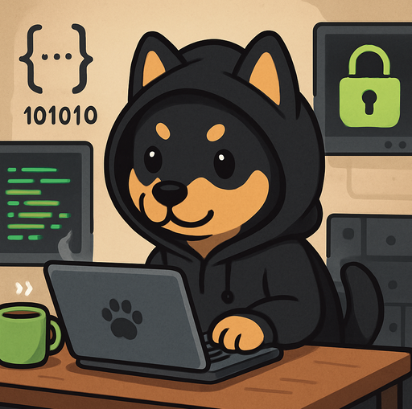

<p align="center">
  
</p>

<h1 align="center">GaGaSpeedVaultBox · VaultBox</h1>

<p align="center">
  本地优先的端到端加密保险箱 —— 你的秘密只属于你
</p>

<p align="center">
  
  
  
</p>

## 简介

VaultBox 是一款基于 **Tauri 2 + Vue 3** 的桌面端加密保险箱，采用**本地优先、端到端加密**设计：

- 所有数据**仅存储在你的设备本地**，使用 **AES-256-GCM** 认证加密，密钥由主密码通过 **Argon2id** 抗暴力破解算法派生；
- 主密码与密钥**永远不会离开设备**，开发者无法读取、无法重置你的保险箱内容；
- 可选的**自建服务器联网同步**：同步数据全部为密文，服务器与任何中间方都无法解密。

## 当前版本（v0.1.0）主要功能

**本地保险箱**

- 🗝️ 初始化保险箱：主密码 + Argon2id（64/128 MiB 内存强度）派生加密密钥
- 🔓 解锁 / 一键锁定，闲置自动锁定（可配置超时时间）
- 📝 条目管理：账号、密码、备注的增、删、改、查
- 📋 一键复制：密码/内容复制到剪贴板（仅在你主动点击时写入）
- 🔑 修改主密码：容器整体重加密，数据不丢失
- 🆘 忘记密码恢复：通过预设的恢复问题重新打包保险箱
- 💾 关闭应用前自动落盘：有未保存变更时先同步写盘再退出

**联网同步（可选，连接你自建的服务器）**

- 🌐 服务器连通性测试、注册 / 登录 / 注销
- 🔄 手动同步：本地与远程密文合并
- ⚖️ 冲突解决：同步冲突时可选择保留本地或远程版本
- 🔒 传输与存储全程密文，密钥不出设备

## 界面预览

- 初始化向导：选择「仅本地」或「自建服务器同步」模式
- 解锁页：主密码输入 + 恢复入口
- 保险箱主页：条目列表、搜索、复制、编辑
- 设置页：自动锁定时间、修改主密码、同步管理、关于

## 技术栈

| 层 | 技术 |
| --- | --- |
| 桌面框架 | Tauri 2（Rust） |
| 前端 | Vue 3 + Vite + TypeScript + Element Plus + Pinia |
| 加密 | argon2（Argon2id）、aes-gcm（AES-256-GCM）、hkdf、sha2 |
| 存储 | rusqlite（SQLite，bundled）本地密文库 |

## 快速开始

```bash
# 安装依赖
pnpm install

# 开发模式运行
pnpm tauri dev

# 编译 Release（输出安装包到 src-tauri/target/release/bundle/）
pnpm tauri build
```

纯本地版本（不包含任何联网代码，`--no-default-features`）：

```bash
pnpm tauri build -- --no-default-features
```

## 项目结构

```
├── src/                    # Vue 3 前端
│   ├── assets/brand/       # 品牌资源（logo、公众号二维码）
│   ├── composables/        # useVault / useAutoLock 等组合式函数
│   ├── stores/             # Pinia 状态（会话、条目、版本信息）
│   ├── views/              # 页面（初始化/解锁/主页/设置/恢复）
│   └── router/             # vue-router 路由与守卫
├── src-tauri/              # Tauri 2 桌面层（Rust）
│   ├── src/
│   │   ├── commands/       # #[tauri::command] 薄层（本地/条目/恢复/远程/同步）
│   │   ├── crypto/         # Argon2id + AES-256-GCM 核心加密
│   │   ├── vault/          # 保险箱容器（序列化/封装/重加密）
│   │   ├── db/             # SQLite 本地存储
│   │   └── bin/crypto_cli.rs  # 与核心模块同源的 CLI 工具
│   ├── tauri.conf.json     # Tauri 配置
│   └── icons/              # 应用图标
├── PRIVACY.md              # 隐私政策（中英双语）
└── privacy-policy.html     # 隐私政策网页版（可部署到官网）
```

## 隐私政策

VaultBox 不收集、不上传、不出售任何个人数据。详见 [隐私政策](./PRIVACY.md)。

## 关注我们

微信扫码关注公众号，获取更新动态与安全公告：

<p align="center">
  
</p>

## Star History

[](https://star-history.com/#ShinLee666/GaGaSpeedVaultBox&Date)

## License

[MIT](./LICENSE)
